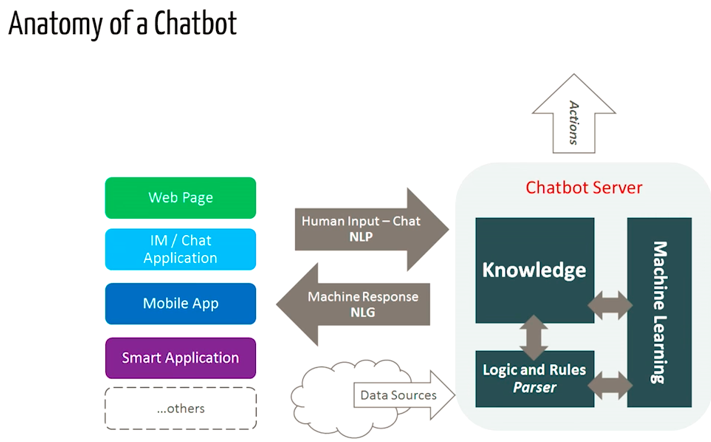

# Chatbot_using_NLP

## Pre-requisites
Hands-On knowledge of scikit library and NLTK is assumed. However, if you are new to NLP, you can still read the article and then refer back to resources.

##  Downloading and installing NLTK
### Install NLTK: run pip install nltk
Test installation: run python then type import nltk
For platform-specific instructions, read here.
### Installing NLTK Packages
import NLTK and run nltk.download().This will open the NLTK downloader from where you can choose the corpora and models to download. You can also download all packages at once.

### Text Pre- Processing with NLTK

The main issue with text data is that it is all in text format (strings). However, Machine learning algorithms need some sort of numerical feature vector in order to perform the task. So before we start with any NLP project we need to pre-process it to make it ideal for work. Basic text pre-processing includes:
Converting the entire text into uppercase or lowercase, so that the algorithm does not treat the same words in different cases as different

### Tokenization: 
Tokenization is just the term used to describe the process of converting the normal text strings into a list of tokens i.e words that we actually want. Sentence tokenizer can be used to find the list of sentences and Word tokenizer can be used to find the list of words in strings.
The NLTK data package includes a pre-trained Punkt tokenizer for English.
Removing Noise i.e everything that isn’t in a standard number or letter.
Removing Stop words. Sometimes, some extremely common words which would appear to be of little value in helping select documents matching a user need are excluded from the vocabulary entirely. These words are called stop words

### Stemming: 
Stemming is the process of reducing inflected (or sometimes derived) words to their stem, base or root form — generally a written word form. Example if we were to stem the following words: “Stems”, “Stemming”, “Stemmed”, “and Stemtization”, the result would be a single word “stem”.

### Bag of Words
After the initial preprocessing phase, we need to transform the text into a meaningful vector (or array) of numbers. The bag-of-words is a representation of text that describes the occurrence of words within a document.

